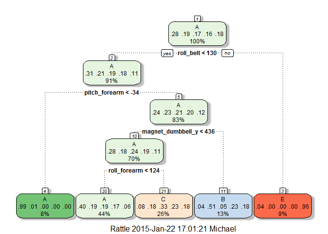
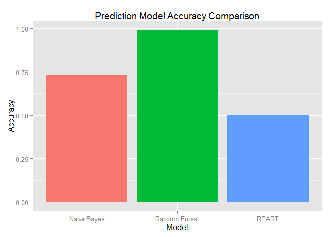

# Practical Machine Learning Course Project
Author: Mike Silva  
Date: January 2015 

## Background
 
Six young health participants were asked to perform one set of 10 repetitions of the unilateral dumbbell biceps curl in five different fashions: exactly according to the specification (Class A), throwing the elbows to the front (Class B), lifting the dumbbell only halfway (Class C), lowering the dumbbell only halfway (Class D) and throwing the hips to the front (Class E). These activites were monitored with on-body wearable accelerometers.

The task that I intend to preform is to develop a model that predicts what activity is being preformed based on the data that was collected, and use this model to classify twenty cases.  I will accomplish this by selecting the model that predicts with the highest degree of accuracy.

## Feature Selection
I begin the process by loading the libraries I will need throughout the analysis.  As I want my research to be reproducible I will set the random number generation seed to 3.14:

```r
library(caret)
library(rattle)
set.seed(3.14)
```

Next I download the data if it doesn't exist in the working directory:

```r
training.file <- 'pml-training.csv'
if(!file.exists(training.file)){
  download.file('http://d396qusza40orc.cloudfront.net/predmachlearn/pml-training.csv', training.file)
}
testing.file <- 'pml-testing.csv'
if(!file.exists(testing.file)){
  download.file('http://d396qusza40orc.cloudfront.net/predmachlearn/pml-testing.csv', testing.file)
}
```

The data has missing values and excel error messages.  I cleaned these up and standardized the missing values as I load the data into the environment:

```r
training <- read.csv(training.file, na.strings=c('NA','#DIV/0!',''))
testing <- read.csv(testing.file, na.strings=c('NA','#DIV/0!',''))
```

Initially there are 160 features.  This is too many to create a useful prediction model so I determined I needed to remove some of the features.  I removed all features that have are nothing but missing values:

```r
training <- training[,colSums(is.na(training)) == 0]
testing <- testing[,colSums(is.na(testing)) == 0]
```

After this step I am left with 60 features.  Next I deleted the first 7 features (X, user_name, raw_timestamp_part_1, raw_timestamp_part_2, cvtd_timestamp, new_window, num_window) as they are meta data and not useful in forming a prediction model:

```r
training <- training[, -c(1:7)]
testing <- testing[, -c(1:7)]
```

I am now left with a pool of 53 possible features for inclusion in the prediction model.  A list of the feature and a sample of the data is given in the appendix.

## Partitioning Data Set

The data set that I am going to create my prediction model from contains 19622 observations.  In order to cross validate the models I partitioned this data set into two subsets.  I used 60% of the data for model training and 40% for cross validation.

```r
subset <- createDataPartition(y=training$classe, p=0.6, list=FALSE)
subset.for.training <- training[subset,]
subset.for.testing <- training[-subset,]
```

## Modelling Approaches

### Recursive Partitioning and Regression Trees
I selected this approach as a way to form a baseline.  I did not expect this to provide a reliable prediction model.  However I needed something to compare the other models against.

```r
rpart.fit <- train(classe ~ ., data=subset.for.training, method='rpart')
predict.rpart <- predict(rpart.fit, subset.for.testing)
fancyRpartPlot(rpart.fit $finalModel)
```

 

```r
rpart.cm <- confusionMatrix(predict.rpart, subset.for.testing$classe)
rpart.cm
```

```
## Confusion Matrix and Statistics
## 
##           Reference
## Prediction    A    B    C    D    E
##          A 2004  623  634  586  169
##          B   39  533   38  238  196
##          C  154  362  696  462  376
##          D    0    0    0    0    0
##          E   35    0    0    0  701
## 
## Overall Statistics
##                                           
##                Accuracy : 0.5014          
##                  95% CI : (0.4903, 0.5125)
##     No Information Rate : 0.2845          
##     P-Value [Acc > NIR] : < 2.2e-16       
##                                           
##                   Kappa : 0.349           
##  Mcnemar's Test P-Value : NA              
## 
## Statistics by Class:
## 
##                      Class: A Class: B Class: C Class: D Class: E
## Sensitivity            0.8978  0.35112  0.50877   0.0000  0.48613
## Specificity            0.6416  0.91925  0.79098   1.0000  0.99453
## Pos Pred Value         0.4990  0.51054  0.33951      NaN  0.95245
## Neg Pred Value         0.9405  0.85519  0.88406   0.8361  0.89578
## Prevalence             0.2845  0.19347  0.17436   0.1639  0.18379
## Detection Rate         0.2554  0.06793  0.08871   0.0000  0.08934
## Detection Prevalence   0.5119  0.13306  0.26128   0.0000  0.09381
## Balanced Accuracy      0.7697  0.63518  0.64988   0.5000  0.74033
```


### Naive Bayes
I selected this approach because I am a big fan of the Bayesian approach in statistical modelling and I wanted to get some practical experience with it.  

```r
nb.fit <- train(classe ~ ., data=subset.for.training, method="nb")
nb.cm <- confusionMatrix(predict.nb, subset.for.testing$classe)
nb.cm
```

```
## Confusion Matrix and Statistics
## 
##           Reference
## Prediction    A    B    C    D    E
##          A 1950  309  315  229   79
##          B   46  984   93    2  106
##          C  100  121  895  184   59
##          D  115   59   49  796   69
##          E   21   45   16   75 1129
## 
## Overall Statistics
##                                           
##                Accuracy : 0.7334          
##                  95% CI : (0.7234, 0.7431)
##     No Information Rate : 0.2845          
##     P-Value [Acc > NIR] : < 2.2e-16       
##                                           
##                   Kappa : 0.6591          
##  Mcnemar's Test P-Value : < 2.2e-16       
## 
## Statistics by Class:
## 
##                      Class: A Class: B Class: C Class: D Class: E
## Sensitivity            0.8737   0.6482   0.6542   0.6190   0.7829
## Specificity            0.8340   0.9610   0.9284   0.9555   0.9755
## Pos Pred Value         0.6766   0.7994   0.6586   0.7316   0.8779
## Neg Pred Value         0.9432   0.9193   0.9271   0.9275   0.9523
## Prevalence             0.2845   0.1935   0.1744   0.1639   0.1838
## Detection Rate         0.2485   0.1254   0.1141   0.1015   0.1439
## Detection Prevalence   0.3673   0.1569   0.1732   0.1387   0.1639
## Balanced Accuracy      0.8538   0.8046   0.7913   0.7872   0.8792
```


### Random Forest
I selected this approach out of curiosity to see if it could out preform the Bayesian model.

```r
rf.fit <- train(classe ~ ., data = subset.for.training, method = 'rf', 
                trControl = trainControl(method = "cv", number = 4, allowParallel = TRUE), importance=TRUE)
predict.rf <- predict(rf.fit, subset.for.testing)
rf.cm <- confusionMatrix(predict.rf, subset.for.testing$classe)
rm.imp <- varImp(rf.fit)
rf.cm
```

```
## Confusion Matrix and Statistics
## 
##           Reference
## Prediction    A    B    C    D    E
##          A 2231   15    0    0    0
##          B    0 1497   16    0    0
##          C    0    6 1349   25    5
##          D    0    0    3 1261    8
##          E    1    0    0    0 1429
## 
## Overall Statistics
##                                          
##                Accuracy : 0.9899         
##                  95% CI : (0.9875, 0.992)
##     No Information Rate : 0.2845         
##     P-Value [Acc > NIR] : < 2.2e-16      
##                                          
##                   Kappa : 0.9873         
##  Mcnemar's Test P-Value : NA             
## 
## Statistics by Class:
## 
##                      Class: A Class: B Class: C Class: D Class: E
## Sensitivity            0.9996   0.9862   0.9861   0.9806   0.9910
## Specificity            0.9973   0.9975   0.9944   0.9983   0.9998
## Pos Pred Value         0.9933   0.9894   0.9740   0.9914   0.9993
## Neg Pred Value         0.9998   0.9967   0.9971   0.9962   0.9980
## Prevalence             0.2845   0.1935   0.1744   0.1639   0.1838
## Detection Rate         0.2843   0.1908   0.1719   0.1607   0.1821
## Detection Prevalence   0.2863   0.1928   0.1765   0.1621   0.1823
## Balanced Accuracy      0.9984   0.9918   0.9903   0.9894   0.9954
```

## Model Evaluation

 

Because of the high level of accuracy of the random forest model, I chose to use it to predict classify the 20 test cases.

# Appendix 1: Features
_roll_belt_, _pitch_belt_, _yaw_belt_, _total_accel_belt_, _gyros_belt_x_, _gyros_belt_y_, _gyros_belt_z_, _accel_belt_x_, _accel_belt_y_, _accel_belt_z_, _magnet_belt_x_, _magnet_belt_y_, _magnet_belt_z_, _roll_arm_, _pitch_arm_, _yaw_arm_, _total_accel_arm_, _gyros_arm_x_, _gyros_arm_y_, _gyros_arm_z_, _accel_arm_x_, _accel_arm_y_, _accel_arm_z_, _magnet_arm_x_, _magnet_arm_y_, _magnet_arm_z_, _roll_dumbbell_, _pitch_dumbbell_, _yaw_dumbbell_, _total_accel_dumbbell_, _gyros_dumbbell_x_, _gyros_dumbbell_y_, _gyros_dumbbell_z_, _accel_dumbbell_x_, _accel_dumbbell_y_, _accel_dumbbell_z_, _magnet_dumbbell_x_, _magnet_dumbbell_y_, _magnet_dumbbell_z_, _roll_forearm_, _pitch_forearm_, _yaw_forearm_, _total_accel_forearm_, _gyros_forearm_x_, _gyros_forearm_y_, _gyros_forearm_z_, _accel_forearm_x_, _accel_forearm_y_, _accel_forearm_z_, _magnet_forearm_x_, _magnet_forearm_y_, _magnet_forearm_z_ and _classe_

# Appendix 2: Sample Data


|  roll_belt  |  pitch_belt  |  yaw_belt  |  total_accel_belt  |  gyros_belt_x  |  gyros_belt_y  |  gyros_belt_z  |  accel_belt_x  |  accel_belt_y  |  accel_belt_z  |  magnet_belt_x  |  magnet_belt_y  |  magnet_belt_z  |  roll_arm  |  pitch_arm  |  yaw_arm  |  total_accel_arm  |  gyros_arm_x  |  gyros_arm_y  |  gyros_arm_z  |  accel_arm_x  |  accel_arm_y  |  accel_arm_z  |  magnet_arm_x  |  magnet_arm_y  |  magnet_arm_z  |  roll_dumbbell  |  pitch_dumbbell  |  yaw_dumbbell  |  total_accel_dumbbell  |  gyros_dumbbell_x  |  gyros_dumbbell_y  |  gyros_dumbbell_z  |  accel_dumbbell_x  |  accel_dumbbell_y  |  accel_dumbbell_z  |  magnet_dumbbell_x  |  magnet_dumbbell_y  |  magnet_dumbbell_z  |  roll_forearm  |  pitch_forearm  |  yaw_forearm  |  total_accel_forearm  |  gyros_forearm_x  |  gyros_forearm_y  |  gyros_forearm_z  |  accel_forearm_x  |  accel_forearm_y  |  accel_forearm_z  |  magnet_forearm_x  |  magnet_forearm_y  |  magnet_forearm_z  |  classe  |
|:-----------:|:------------:|:----------:|:------------------:|:--------------:|:--------------:|:--------------:|:--------------:|:--------------:|:--------------:|:---------------:|:---------------:|:---------------:|:----------:|:-----------:|:---------:|:-----------------:|:-------------:|:-------------:|:-------------:|:-------------:|:-------------:|:-------------:|:--------------:|:--------------:|:--------------:|:---------------:|:----------------:|:--------------:|:----------------------:|:------------------:|:------------------:|:------------------:|:------------------:|:------------------:|:------------------:|:-------------------:|:-------------------:|:-------------------:|:--------------:|:---------------:|:-------------:|:---------------------:|:-----------------:|:-----------------:|:-----------------:|:-----------------:|:-----------------:|:-----------------:|:------------------:|:------------------:|:------------------:|:--------:|
|    1.41     |     8.07     |   -94.4    |         3          |       0        |       0        |     -0.02      |      -21       |       4        |       22       |       -3        |       599       |      -313       |    -128    |    22.5     |   -161    |        34         |       0       |       0       |     -0.02     |     -288      |      109      |     -123      |      -368      |      337       |      516       |      13.05      |      -70.49      |     -84.87     |           37           |         0          |       -0.02        |         0          |        -234        |         47         |        -271        |        -559         |         293         |         -65         |      28.4      |      -63.9      |     -153      |          36           |       0.03        |         0         |       -0.02       |        192        |        203        |       -215        |        -17         |        654         |        476         |    A     |
|    1.41     |     8.07     |   -94.4    |         3          |      0.02      |       0        |     -0.02      |      -22       |       4        |       22       |       -7        |       608       |      -311       |    -128    |    22.5     |   -161    |        34         |     0.02      |     -0.02     |     -0.02     |     -290      |      110      |     -125      |      -369      |      337       |      513       |      13.13      |      -70.64      |     -84.71     |           37           |         0          |       -0.02        |         0          |        -233        |         47         |        -269        |        -555         |         296         |         -64         |      28.3      |      -63.9      |     -153      |          36           |       0.02        |         0         |       -0.02       |        192        |        203        |       -216        |        -18         |        661         |        473         |    A     |
|    1.42     |     8.07     |   -94.4    |         3          |       0        |       0        |     -0.02      |      -20       |       5        |       23       |       -2        |       600       |      -305       |    -128    |    22.5     |   -161    |        34         |     0.02      |     -0.02     |     -0.02     |     -289      |      110      |     -126      |      -368      |      344       |      513       |      12.85      |      -70.28      |     -85.14     |           37           |         0          |       -0.02        |         0          |        -232        |         46         |        -270        |        -561         |         298         |         -63         |      28.3      |      -63.9      |     -152      |          36           |       0.03        |       -0.02       |         0         |        196        |        204        |       -213        |        -18         |        658         |        469         |    A     |
|    1.48     |     8.05     |   -94.4    |         3          |      0.02      |       0        |     -0.03      |      -22       |       3        |       21       |       -6        |       604       |      -310       |    -128    |    22.1     |   -161    |        34         |     0.02      |     -0.03     |     0.02      |     -289      |      111      |     -123      |      -372      |      344       |      512       |      13.43      |      -70.39      |     -84.87     |           37           |         0          |       -0.02        |       -0.02        |        -232        |         48         |        -269        |        -552         |         303         |         -60         |      28.1      |      -63.9      |     -152      |          36           |       0.02        |       -0.02       |         0         |        189        |        206        |       -214        |        -16         |        658         |        469         |    A     |
|    1.48     |     8.07     |   -94.4    |         3          |      0.02      |      0.02      |     -0.02      |      -21       |       2        |       24       |       -6        |       600       |      -302       |    -128    |    22.1     |   -161    |        34         |       0       |     -0.03     |       0       |     -289      |      111      |     -123      |      -374      |      337       |      506       |      13.38      |      -70.43      |     -84.85     |           37           |         0          |       -0.02        |         0          |        -233        |         48         |        -270        |        -554         |         292         |         -68         |       28       |      -63.9      |     -152      |          36           |       0.02        |         0         |       -0.02       |        189        |        206        |       -214        |        -17         |        655         |        473         |    A     |
|    1.45     |     8.06     |   -94.4    |         3          |      0.02      |       0        |     -0.02      |      -21       |       4        |       21       |        0        |       603       |      -312       |    -128    |     22      |   -161    |        34         |     0.02      |     -0.03     |       0       |     -289      |      111      |     -122      |      -369      |      342       |      513       |      13.38      |      -70.82      |     -84.47     |           37           |         0          |       -0.02        |         0          |        -234        |         48         |        -269        |        -558         |         294         |         -66         |      27.9      |      -63.9      |     -152      |          36           |       0.02        |       -0.02       |       -0.03       |        193        |        203        |       -215        |         -9         |        660         |        478         |    A     |
